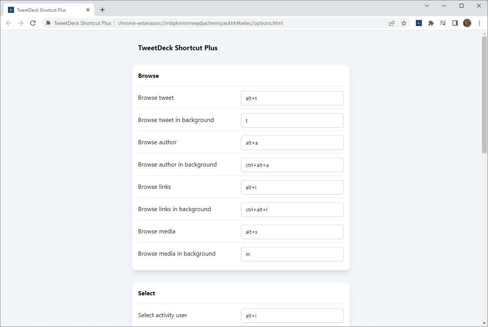

# TweetDeck Shortcut Plus

Browser extension to add more keyboard shortcuts to TweetDeck.

## Keyboard shortcuts

### Browse

- Browse tweet (default: <kbd>alt+b</kbd>)
- Browse tweet in background (default: <kbd>b</kbd>)
- Browse author (default: <kbd>alt+a</kbd>)
- Browse author in background (default: <kbd>ctrl+alt+a</kbd>)
- Browse links (default: <kbd>alt+l</kbd>)
- Browse links in background (default: <kbd>u</kbd>)
- Browse media (default: <kbd>alt+s</kbd>)
- Browse media in background (default: <kbd>i</kbd>)

### Select

- Select author (default: <kbd>alt+p</kbd>)
- Select first hashtag (default: <kbd>alt+h</kbd>)
- Select first image (default: <kbd>o</kbd>)
- Select quoted tweet (default: <kbd>alt+k</kbd>)
- Select likes (default: <kbd>alt+f</kbd>)
- Select retweets (default: <kbd>alt+r</kbd>)
- Select activity user (default: <kbd>alt+i</kbd>)

### Column

- Add author column (default: <kbd>alt+u</kbd>)
- Add activity user column (default: <kbd>alt+y</kbd>)
- Remove column (default: <kbd>alt+d</kbd>)

### Others

- Download media (default: <kbd>w</kbd>)
- Quote tweet (default: <kbd>q</kbd>)
- Delete tweet (default: <kbd>alt+delete</kbd>)

## Configuration

Customize the keyboard shortcuts from options page.

